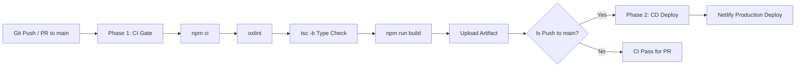

# Shadman Muhtasim — Personal Engineering Portfolio

[](https://github.com/ShadmanMuhtasim/ShadmanMuhtasim_portfolio/actions/workflows/ci-cd.yml)
[](https://app.netlify.com/sites/shadmanmuhtasim/deploys)


A modern, spacious, recruiter-friendly personal engineering portfolio designed with an editorial dark aesthetic. Built with React 19, TypeScript, Tailwind CSS, and Framer Motion.

---

## ⚡ Tech Stack & Architecture

- **Frontend**: React 19, TypeScript, Vite
- **Styling**: Tailwind CSS (with custom dark theme tokens), CSS animations
- **Interactions & Motion**: Framer Motion (layout animations, modal transitions, carousels)
- **Icons**: Lucide React & Custom Brand SVG Components
- **Hosting & Infrastructure**: Netlify with custom security headers and SPA routing
- **CI/CD Automation**: GitHub Actions (automated quality gating, type checking, production compilation, and atomic deployment)

---

## 🚀 CI/CD Pipeline Architecture

This repository uses an automated, two-phase GitHub Actions workflow configured in [`.github/workflows/ci-cd.yml`](.github/workflows/ci-cd.yml):



1. **Phase 1 — CI (Quality & Build Gate)**:
   - Triggers on `push` and `pull_request` targeting the `main` branch.
   - Runs on `ubuntu-latest` with **Node.js 20 LTS** and npm caching.
   - Executes dependency check (`npm ci`), code quality analysis (`npm run lint`), strict type-checking (`npx tsc -b`), and production bundle compilation (`npm run build`).
   - Produces a verified production artifact (`dist/`).

2. **Phase 2 — CD (Netlify Production Deployment)**:
   - Triggers exclusively on `push` to `main` after all CI quality checks pass.
   - Atomically deploys the verified `dist/` bundle to Netlify using the Netlify CLI.
   - Generates a real-time markdown deployment summary in the GitHub Actions run report.

---

## 🛠️ Local Development & Scripts

### Prerequisites
- Node.js >= 20.x
- npm >= 10.x

### Quick Start
```bash
# Clone the repository
git clone https://github.com/ShadmanMuhtasim/ShadmanMuhtasim_portfolio.git
cd ShadmanMuhtasim_portfolio

# Install clean dependencies
npm ci

# Launch development server
npm run dev

# Open http://localhost:5173 in your browser
```

### Available Scripts
| Command | Description |
| :--- | :--- |
| `npm run dev` | Starts the Vite local development server with HMR |
| `npm run build` | Compiles TypeScript (`tsc -b`) and bundles for production (`vite build`) |
| `npm run lint` | Runs Oxlint linter across all source files |
| `npm test` | Executes the test suite (if configured) |
| `npm run preview` | Locally previews the compiled production bundle from `dist/` |

---

## 🔐 Required GitHub Secrets for CD

To enable automated deployments to Netlify from GitHub Actions, configure the following secrets under **Settings > Secrets and variables > Actions**:

| Secret Name | Description |
| :--- | :--- |
| `NETLIFY_AUTH_TOKEN` | Netlify Personal Access Token generated from User Settings |
| `NETLIFY_SITE_ID` | API ID of your Netlify site (`28976e2a-4cb5-44af-8438-32f2709f4150`) |

---

## 📄 License
Designed and engineered by **Shadman Muhtasim** © 2026. All rights reserved.
